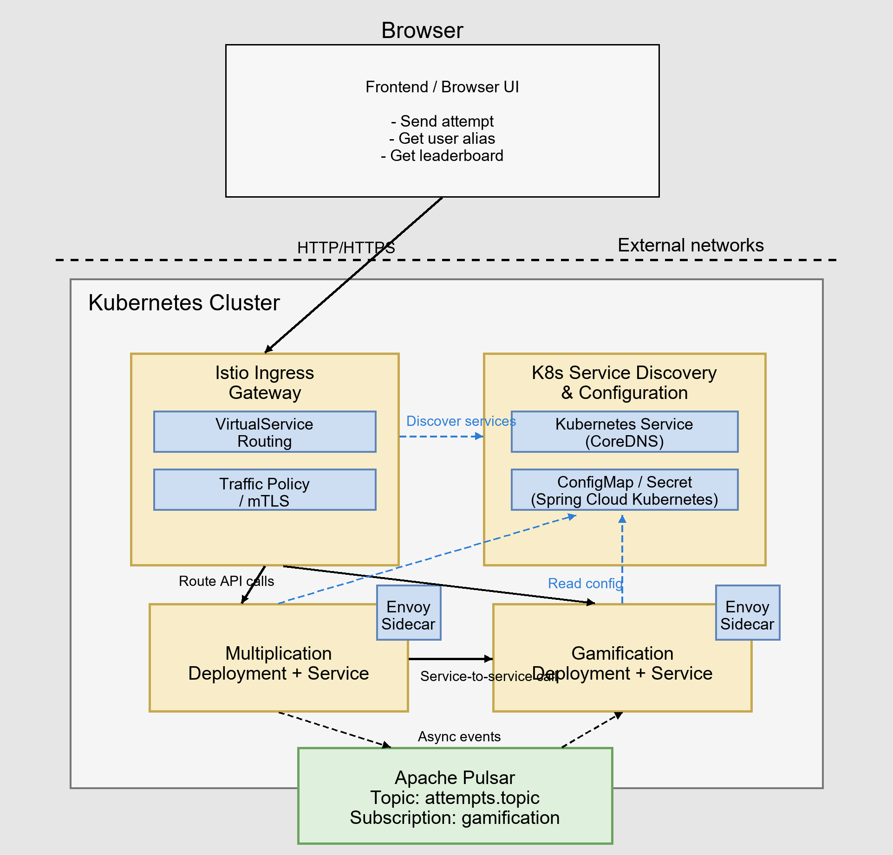

# Learn Microservices with Spring Boot - Kubernetes and Istio Edition

This repository demonstrates a modern microservices architecture using Spring Boot 3, Kubernetes, and Istio service mesh. It includes centralized logging with Apache Pulsar and distributed tracing with Zipkin.

## Architecture Overview

This project demonstrates a cloud-native microservices architecture using Kubernetes and Istio service mesh.



## Technology Stack

- **Spring Boot 4.0.2** with Spring Cloud 2025.1.1
- **Kubernetes** for container orchestration
- **Istio** service mesh for traffic management, security, and observability
- **Apache Pulsar** for event-driven messaging
- **Spring Cloud Kubernetes** for ConfigMap integration
- **Zipkin** for distributed tracing
- **H2 Database** for data persistence
- **React** frontend application

## Key Architecture Components

| Component | Implementation |
|-----------|----------------|
| Service Discovery | Kubernetes Service + Istio |
| Configuration Management | Kubernetes ConfigMap + Spring Cloud Kubernetes |
| API Gateway | Istio Ingress Gateway |
| Load Balancing | Istio Envoy Sidecar |
| Circuit Breaker | Istio DestinationRule |
| Distributed Tracing | Istio + Zipkin |
| Message Queue | Apache Pulsar |
| Security | Istio mTLS (mutual TLS) |

## Features

* Kubernetes-native microservices deployment
* Istio service mesh for traffic management
* Centralized logging with Pulsar
* Event-driven architecture with Spring Pulsar
* Distributed tracing with Istio and Zipkin
* Container orchestration with Kubernetes
* Service mesh capabilities (traffic routing, load balancing, circuit breaking)
* Strict mTLS for inter-service communication

## Microservices

1. **multiplication** - Multiplication challenge service (port 8080)
2. **gamification** - Gamification and leaderboard service (port 8081)
3. **logs** - Centralized log processing service (port 8580)

## Running on Kubernetes with Istio

### Prerequisites

- kind (Kubernetes in Docker)
- kubectl CLI tool
- istioctl CLI tool
- Docker
- Maven 3.8+
- JDK 17+
- Node.js 16+ (for frontend)

### Step 1: Create Kubernetes Cluster

#### Using kind (Recommended for local development)

1. Install kind if not already installed:
```bash
# Windows (using Chocolatey)
choco install kind

# macOS
brew install kind

# Linux
curl -Lo ./kind https://kind.sigs.k8s.io/dl/latest/kind-linux-amd64
chmod +x ./kind
sudo mv ./kind /usr/local/bin/kind
```

2. Create the cluster:
```bash
kind create cluster --config kind-config.yaml
```

3. Verify cluster is running:
```bash
kubectl cluster-info
kubectl get nodes
```

### Step 2: Install Istio

1. Download and install istioctl:
```bash
# macOS/Linux
curl -L https://istio.io/downloadIstio | sh -
cd istio-*
export PATH=$PWD/bin:$PATH

# Windows: Download from https://github.com/istio/istio/releases
```

2. Install Istio with default profile:
```bash
istioctl install --set profile=default -y
```

3. Configure Istio Gateway for kind (hostPort mode):
```bash
# Patch Istio Gateway to use hostPort
kubectl patch deployment istio-ingressgateway -n istio-system --type=json -p='[{"op":"replace","path":"/spec/template/spec/containers/0/ports","value":[{"containerPort":15021,"protocol":"TCP"},{"containerPort":8080,"hostPort":80,"protocol":"TCP"},{"containerPort":8443,"hostPort":443,"protocol":"TCP"}]}]'

# Change Service to ClusterIP
kubectl patch svc istio-ingressgateway -n istio-system -p '{"spec":{"type":"ClusterIP"}}'
```

4. Wait for Istio to be ready:
```bash
kubectl rollout status deployment/istio-ingressgateway -n istio-system
```

5. Create namespace with Istio injection enabled:
```bash
kubectl apply -f k8s/namespace.yaml
```

### Step 3: Build Images

Build Docker images for all services:

```bash
# Build JAR files
cd multiplication && mvn clean package -DskipTests
cd ../gamification && mvn clean package -DskipTests
cd ../logs && mvn clean package -DskipTests
cd ..

# Build Docker images
cd multiplication && docker build -t multiplication:0.0.1-SNAPSHOT .
cd ../gamification && docker build -t gamification:0.0.1-SNAPSHOT .
cd ../logs && docker build -t logs:0.0.1-SNAPSHOT .
cd ..

# Build frontend
cd challenges-frontend
npm install
npm run build
docker build -t challenges-frontend:1.0 .
cd ..
```

### Step 4: Load Images to kind (skip if using Docker Desktop)

```bash
kind load docker-image multiplication:0.0.1-SNAPSHOT
kind load docker-image gamification:0.0.1-SNAPSHOT
kind load docker-image logs:0.0.1-SNAPSHOT
kind load docker-image challenges-frontend:1.0
```

### Step 5: Deploy to Kubernetes

```bash
# Create namespace first
kubectl apply -f k8s/namespace.yaml

# Deploy RBAC for ConfigMap access
kubectl apply -f k8s/rbac.yaml

# Deploy infrastructure services
kubectl apply -f k8s/pulsar-deployment.yaml
kubectl apply -f k8s/zipkin-deployment.yaml

# Deploy microservices
kubectl apply -f k8s/multiplication-deployment.yaml
kubectl apply -f k8s/gamification-deployment.yaml
kubectl apply -f k8s/logs-deployment.yaml
kubectl apply -f k8s/challenges-frontend-deployment.yaml

# Deploy Istio configurations
kubectl apply -f k8s/istio-gateway.yaml
kubectl apply -f k8s/istio-destination-rules.yaml
kubectl apply -f k8s/istio-peer-auth.yaml
```

### Step 6: Verify Deployment

```bash
# Check all pods are running
kubectl get pods -n microservices

# Check services
kubectl get svc -n microservices

# Check Istio Gateway
kubectl get gateway -n microservices
kubectl get virtualservice -n microservices
```

### Access the Application

#### For kind cluster:
Access the application at: `http://localhost`

#### For Docker Desktop Kubernetes:
Get the Istio Ingress Gateway external IP:

```bash
kubectl get svc istio-ingressgateway -n istio-system
```

Access the API at: `http://<EXTERNAL-IP>/challenges`

### API Endpoints

- Frontend: `http://localhost/`
- Challenges API: `http://localhost/challenges`
- Attempts API: `http://localhost/attempts`
- Users API: `http://localhost/users`
- Leaderboard API: `http://localhost/leaders`
- Zipkin UI: Port-forward to access: `kubectl port-forward -n microservices svc/zipkin 9411:9411`

### Troubleshooting

**Pods stuck in ImagePullBackOff:**
- For kind: Make sure you loaded images with `kind load docker-image`
- For Docker Desktop: Images should be available automatically

**Cannot access http://localhost:**
- Verify Istio Gateway is using hostPort: `kubectl get pod -n istio-system -o yaml | grep hostPort`
- Check if port 80 is already in use: `netstat -ano | findstr :80` (Windows) or `lsof -i :80` (macOS/Linux)

**Pods not starting or stuck in Init:**
- Check logs: `kubectl logs -n microservices <pod-name> -c <container-name>`
- Check events: `kubectl describe pod -n microservices <pod-name>`
- Verify RBAC permissions: `kubectl get role,rolebinding -n microservices`

**ConfigMap not loading:**
- Verify RBAC is applied: `kubectl apply -f k8s/rbac.yaml`
- Check ConfigMap exists: `kubectl get configmap -n microservices`
- Check application logs for "PropertySource" or "ConfigMap" messages

**Application startup blocking (73+ seconds):**
- This was caused by SSL handshake errors when accessing Kubernetes API
- Fixed by applying `k8s/istio-peer-auth.yaml` which configures Istio to allow K8s API access
- Verify the fix: `kubectl get peerauthentication,destinationrule,serviceentry -n microservices`

### Clean Up

```bash
# Delete all resources
kubectl delete namespace microservices

# Delete cluster (kind only)
kind delete cluster --name kind

# Uninstall Istio
istioctl uninstall --purge -y
```

## Project Structure

```
├── multiplication/          # Multiplication challenge microservice
├── gamification/           # Gamification microservice
├── logs/                   # Log processing microservice
├── challenges-frontend/    # Frontend application
└── k8s/                    # Kubernetes and Istio configurations
    ├── namespace.yaml                    # Namespace with Istio injection
    ├── rbac.yaml                         # RBAC for ConfigMap access
    ├── multiplication-deployment.yaml    # Multiplication service
    ├── gamification-deployment.yaml      # Gamification service
    ├── logs-deployment.yaml              # Logs service
    ├── challenges-frontend-deployment.yaml # Frontend
    ├── pulsar-deployment.yaml            # Pulsar messaging
    ├── zipkin-deployment.yaml            # Distributed tracing
    ├── istio-gateway.yaml                # Istio Ingress Gateway
    ├── istio-destination-rules.yaml      # Load balancing rules
    └── istio-peer-auth.yaml              # mTLS and K8s API access
```

## Configuration Management
- Each microservice has a ConfigMap containing its `application.properties`
- Spring Cloud Kubernetes automatically loads ConfigMap as PropertySource
- ConfigMap changes can trigger application reload (if enabled)
- RBAC permissions are required for pods to access ConfigMaps

## Key Kubernetes Resources

1. **namespace.yaml** - Creates `microservices` namespace with Istio sidecar injection enabled
2. **rbac.yaml** - Grants default ServiceAccount permissions to read ConfigMaps and Secrets
3. **istio-peer-auth.yaml** - Configures strict mTLS between services and allows access to Kubernetes API
4. **istio-gateway.yaml** - Defines Istio Ingress Gateway and VirtualServices for routing
5. **istio-destination-rules.yaml** - Configures load balancing and connection pooling

## Development

This project is designed to run on Kubernetes with Istio service mesh. For local development, use kind (Kubernetes in Docker).

## License

This project is based on the book "Learn Microservices with Spring Boot 3" and demonstrates Kubernetes and Istio integration.
